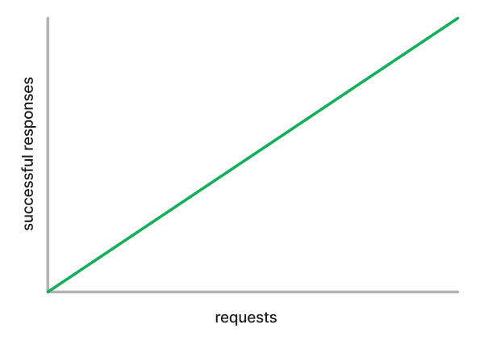
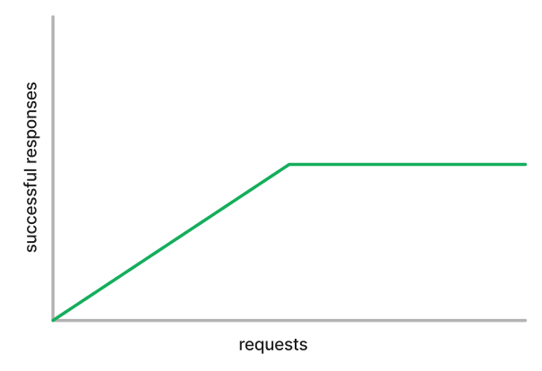

# backpressure

This package is intended to help with load management in a distributed system.

It provides:

- [`Semaphore`](https://pkg.go.dev/github.com/bradenaw/backpressure#Semaphore) for bounding
  concurrency.
- [`RateLimiter`](https://pkg.go.dev/github.com/bradenaw/backpressure#RateLimiter) for bounding
  rate.
- [`AdaptiveThrottle`](https://pkg.go.dev/github.com/bradenaw/backpressure#AdaptiveThrottle) for
  responding to backpressure signals by slowing clients down.

Read on for motivation and explanation of each.

# Quick Background

Resources are in general finite: the number of cores or amount of memory in a machine, the number of
IOPS an SSD is capable of, the throughput of shared resources like mutexes. Generally, capacity
planning can ensure that enough of these resources are available. However, occasionally these
resources are overloaded - often caused by unplanned demand, hotspotting, or accidents. The question
is what to do in these scenarios and how to ensure that a system recovers from them.

A truly **perfect** system would just 'scale up' to handle the load:

This is usually not possible. Scaling up generally _generates_ load before it can alleviate it (for
example, re-replication is not free). An **ideal** system (slightly short of a perfect one, let's
say) looks like this: an under-capacity ideal system serves every request it gets, and an
over-capacity ideal system serves exactly its capacity.

In reality, systems do not look like this. Managing requests has overhead, even if all we're doing
is queueing them. A **realistic** system looks something like this:

Under-capacity it serves every request it gets within a reasonable amount of time. Adding more
requests begins to have diminishing returns, some of those requests complete and some end up waiting
in a queue for too long. At some amount of load, the system begins spending a disproportionate
amount of time managing the requests that it does _not_ end up serving successfully, and the success
rate falls off again. This is called **congestion collapse**. We want to avoid reaching this state.

# Rejection and Backpressure

The overloaded system's best option in this situation is to **reject** requests beyond those that it
can serve successfully. (Let's say successfully also requires serving it within a reasonable time
bound, because higher layers of the stack _including the user_ may time out and retry.) This widens
the part of the curve where it can serve near its theoretical capacity, because rejecting a request
is (usually) cheaper than serving it, especially if the request cannot be finished in time and the
work spent on it is wasted.

The [`Semaphore`](https://pkg.go.dev/github.com/bradenaw/backpressure#Semaphore) and
[`RateLimiter`](https://pkg.go.dev/github.com/bradenaw/backpressure#RateLimiter) types in this
package are meant to help with this. Semaphores may be a better choice when requests have little
transit overhead (say, the resource being accessed is on the same machine as the semaphore, so
there's no latency to actually access it), when requests are highly heterogeneous and their relative
expense cannot be easily estimated (e.g. arbitrary SQL queries), or when the resource itself scales
very poorly under concurrency (e.g. CPU-bound tasks, or those that involve concurrency primitives
that behave poorly under contention). Rate limiters work better than semaphores when requests'
relative costs can be easily estimated, when there is difficult-to-measure overhead that isn't
costly (e.g. network transit to the resource being protected), or when protecting a throughput
resource like disk IOPS or replication speed. Each of these can do their job best when placed _as
close to the resource as possible_, usually in the same process or failing that on the same machine,
but with some care, success can be had deploying them in proxies. If we're going to reject requests,
we may as well be discerning about _which_ requests to reject, and so both of these primitives allow
prioritizing requests to ensure that background jobs and asynchronous work can be sacrificed before
affecting live, user-facing traffic.

Astute readers will have noticed by now that rejection can only delay the inevitable: congestion
collapse still lurks at some rate of requests, even if rejection can move it further away. This is
where **backpressure** comes in: recruiting the cooperation of clients to slow down when too many
requests are sent. (This is not always possible, because your clients may be, say, a DDoS attack
from the wide internet, in which case the only viable avenue is making rejections as cheap as
possible by placing them as close to the client as possible.) Naturally, the best way to communicate
overload to your clients is _with the rejections themselves_, including nondescript errors since we
may be too overloaded to even reject properly or timely. Clients can then use this signal to
estimate the rate of requests that they can send without overloading you, and slow themselves down
accordingly.

There is _tons_ of precedent out there for this: TCP itself behaves this way - two machines
communicating over the internet have to talk through a huge network of routers, and have no idea how
much capacity is available along the entire path from A to B. They learn it by watching how many
packets successfully reach their destination, since overloaded hardware in the middle simply drops
packets on the floor. The
[`AdaptiveThrottle`](https://pkg.go.dev/github.com/bradenaw/backpressure#AdaptiveThrottle) type in
this package is meant to help with this. It measures the rate at which requests are being accepted
by the upstream, and begins (randomly) rejecting requests in the client to limit the rate of
requests actually sent to the upstream to those that it can handle. Paired with [exponential backoff
retries](https://pkg.go.dev/github.com/bradenaw/retry) in the proper layer of the stack (choosing
this is a story for another time), subsystems can relatively accurately estimate the resources
available to them _without even explicitly communicating about this_.

# Queueing and Buffer Bloat

Rejecting a request outright may cost us more resources than it needs to. The client is extremely
likely to retry relatively soon, and if we have the resources available to serve them _then_, we had
to pay resources for the rejection _and_ for serving the request. This is not an uncommon case -
it's desirable to run systems as close to their capacity as possible to reduce costs. Even if the
_aggregate_ rate of requests is reasonably below the capacity, it will frequently _instantaneously_
pass above it, because load is usually rather randomly distributed over time and thus looks
extremely spiky at a fine enough time resolution.

Naturally, the proper response is **queueing**: hold onto the requests we do not currently have the
capacity to serve, because we'll probably be able to serve them very soon. Queues work extremely
well for this purpose: **absorbing short-term load spikes**.

Queues, however, can become extremely painful in slightly more sustained overload. Again imagine a
properly-provisioned server that is serving very near its capacity. When this server inevitably
receives a large load spike, it results in a very large queue. Even once the load spike goes away,
because the server is normally serving at very near its capacity, the queue shrinks _very slowly_.
If the queue is very large, then the requests at the front of the queue have been waiting there for
some time, and may even time out before they can be served. This creates a _sustaining effect_ for
overload: now every request arriving at this server needs to wait its turn in a large backlog of
requests, increasing latency, and many of the requests are unsuccessful because they take so long to
actually be processed. This situation is called **buffer bloat**, because "buffering" and "queueing"
are often used rather interchangeably, and the queue is bloated with the high, persistent number of
requests.

The important thing to note is that _good_ queues, those that are used to absorb short-term load
spikes, are **frequently empty**. A small spike comes in and fills up the queue, the queue quickly
gets emptied again by the server catching up. This is where [**Controlled Delay
(CoDel)**](https://datatracker.ietf.org/doc/html/rfc8289) comes in. (Another concept shamelessly
taken from our friends in networking.) A CoDel is a queue that is processed in FIFO order for
fairness during "good" times to allow for fairness and short tail-latency, and switches to LIFO
order with a very aggressive timeout during overload situations to ensure the queue empties again to
avoid buffer bloat.

At the heart of any semaphore or rate limiter is indeed a queue, and the types provided in this
package use CoDel as their queueing policy to avoid accidentally introducing buffer bloat while
trying to solve load management problems.
